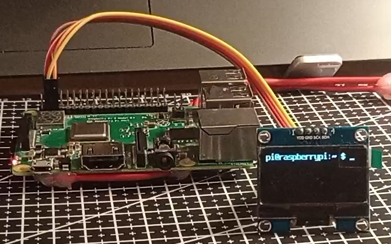

# C++ semester project - Updated

A simple sh1106 framebuffer driver for RPi.



## Main steps

### compiling and installing the driver

```
chmod +x install.sh
./install.sh
```
or
```
make
sudo cp sh1106_fbd.ko /lib/modules/$(uname -r)/
sudo depmod
sudo modprobe sh1106_fbd
```

### Test it
The image should be displayed automatically

To show info about this driver run `modinfo sh1106_fbd`

### How to make it persistent
Run `sudo nano /etc/modules-load.d/sh1106.conf`
Paste
```
i2c-bcm2835
i2c-dev
sh1106_fbd
```
Run `sudo nano /boot/firmware/cmdline.txt` and add ` fbcon=map:1` at the end
Reboot

### How to make the font smaller
Run `sudo dpkg-reconfigure console-setup` and select:
```
1. UTF-8
2. Latin1 and Latin5 - western Europe and Turkic languages
3. Terminus
4. 6x12 (framebuffer only)
```

or run

```
setfont /usr/share/consolefonts/Lat2-Terminus12x6.psf.gz
```

### Dependencies
(Should be installed by default)

1. build-essential
2. raspberrypi-kernel-headers

## Important!
Tested RPi:
```
OS: Debian GNU/Linux 12 (bookworm) aarch64 
Host: Raspberry Pi 3 Model B Plus Rev 1.3 
Kernel: 6.12.47+rpt-rpi-v8 
Uptime: 2 hours, 7 mins 
Packages: 990 (dpkg) 
Shell: bash 5.2.15 
Terminal: /dev/pts/0 
CPU: (4) @ 1.400GHz 
Memory: 108MiB / 906MiB
```

If you want to change color scheme, change FB_VISUAL_MONO10 to FB_VISUAL_MONO01 in the source file and recompile.

### Useful links:
- https://docs.kernel.org/fb/index.html
- https://lwn.net/Kernel/LDD3/

### Why C project for C++ course?
The project was implemented in C instead of C++ to focus on embedded systems and Linux kernel development. This approach was discussed with and approved by my professor.